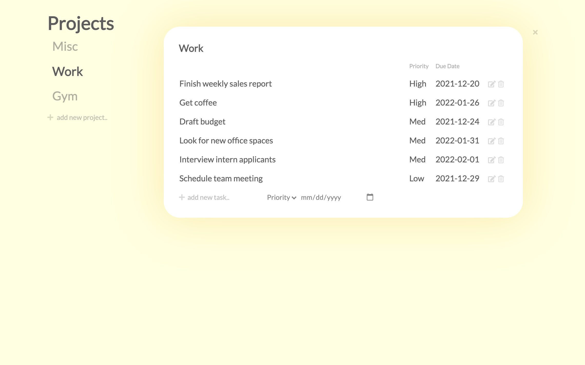

# 📝 Taskbook
A minimalistic to-do list app to manage to-do items, sub-divided by projects.

[Live demo](https://kwen0.github.io/todo-list/)



## Features
- Create, remove, update and delete (CRUD) to-do items and projects
- Assign to-dos to projects with priorities and due dates
- Sort to-dos by priority and by due date
- Local storage functionality: data persists upon browser refresh

## Tools Used
- Plain Javascript
- HTML 
- CSS
- Webpack

## Getting Started
- Clone this project
```
$ git clone git@github.com:kwen0/todo-list.git
```
- Install the required dependencies by running `npm install`
- To run this app locally, run `npm start`
- Distribution files can be produced with `npm run build`

## Future Features
- Implement mobile friendliness
- Add a dashboard that contains a summary of to-dos due soon